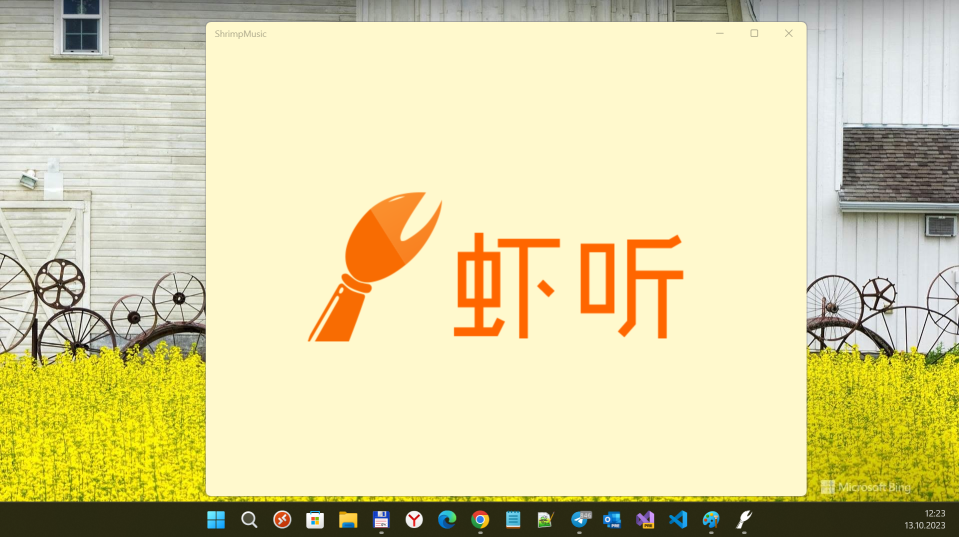

# XiamiTing (ShrimpMusic codename)
My fork of XiamiTing project for old sweet UWP/Template10/Background Tasks exploring

## About 
Its only my little and dirty RnD of cmpute's XiamiTing project... and no more :)

## Screenshots

## Original description (in Chinise):

* XiamiTing —— 虾听
虾米音乐第三方播放器，基于Win10 UWP平台

** 计划完成的功能
- ~~播放列表/电台~~
- 自动登录/签到
- 全屏播放
- 侧栏播放列表
- 电台混播
- VPN
- 同步听歌记录到last.fm
- 增加导入网易云歌单

** 计划完成的页面
- 首页的每日推荐/精选集推荐/电台推荐
- 专辑/艺术家/歌曲(可能会融到全屏播放画面中)/精选集
- MV页面
- 用户信息页面
- 全屏播放画面
- 排行榜

## Status
- The original seems to be archived by its developer, sadly ;(
- Maybe, Xiami service reorganized / restructed... so, XiamiTing freezes on splash screen ^ ^ 

## Credits / References
- https://github.com/cmpute Jacob Zhong aka cmpute
- https://github.com/cmpute/XiamiTing Original XiamiTing project

## .
As is. No support. RnD only. DIY.

## ..
[m][e] 2023